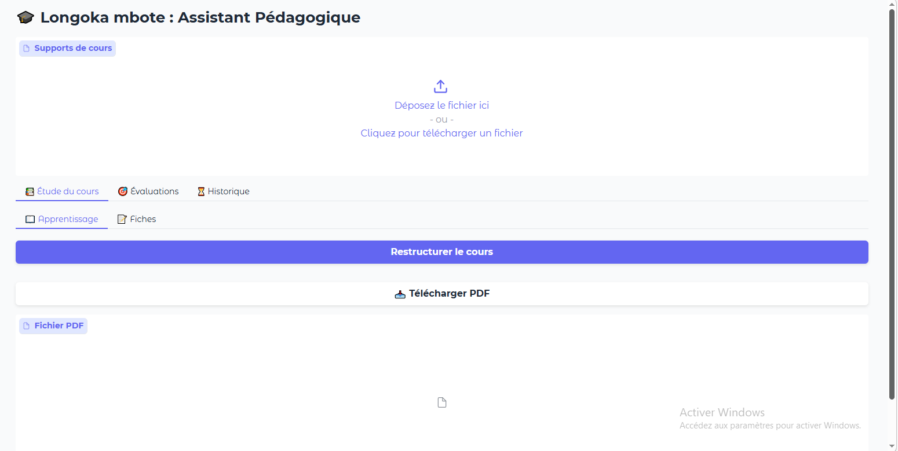

 🧠 AI-Powered Pedagogical Architect : Ingénierie Pédagogique via l'IA

## 🎯 Objectif du Projet
Développer une plateforme intelligente capable de transformer des supports de cours bruts en parcours d'apprentissage structurés, optimisés et personnalisés, en utilisant la puissance des LLM (Large Language Models).

---

## ❌ Le Problème (Le défi pédagogique)
L'accès à l'information est massif, mais la capacité à la structurer pour l'apprentissage est limitée :
- **Surcharge cognitive :** Les apprenants se retrouvent face à des documents longs et denses sans savoir par où commencer.
- **Manque de structure :** Les formateurs passent énormément de temps à créer des plans de cours et des fiches de révision manuellement.
- **Imprécision de l'IA générique :** L'utilisation d'IA classiques (comme ChatGPT sans contexte) peut mener à des "hallucinations" ou à des réponses hors-sujet par rapport au programme officiel.

---
 
## ✅ La Solution : Une IA "Contrainte" et Spécialisée
L'approche repose sur l'idée de transformer l'IA en un **architecte pédagogique** dont le cadre de travail est strictement limité au document fourni par l'utilisateur.

### ⚙️ Fonctionnalités Clés
1. **Analyse Documentaire Contextuelle :**
   - L'utilisateur upload son support de cours (PDF, Texte, etc.).
   - L'IA analyse l'intégralité du contenu pour en extraire les notions clés et la hiérarchie des informations.

2. **Génération de Structuration Pédagogique :**
   - **Restructuration de cours :** Réorganisation du contenu pour une meilleure progression logique.
   - **Plans d'apprentissage :** Création d'un calendrier d'étude étape par étape.
   - **Modèles de fiches de révision :** Synthèse des points critiques sous forme de fiches optimisées pour la mémorisation.

3. **Précision et Fiabilité :**
   - Contrairement à une IA ouverte, le système est programmé pour s'appuyer **uniquement** sur les notions contenues dans le document fourni, garantissant ainsi la conformité avec le programme d'enseignement.

---

## 🚀 Évolution en cours : L'Agent conversationnel (Tuteur IA)
Le projet évolue vers une expérience interactive avec l'intégration d'un **Chatbot intelligent** :
- **Interactivité :** Possibilité pour l'apprenant de poser des questions spécifiques sur un point du cours.
- **Explications personnalisées :** L'IA adapte son niveau de langage en fonction de la demande de l'utilisateur.
- **Personnalisation du programme :** Ajustement du plan d'apprentissage en temps réel selon les difficultés rencontrées.

---

## 🛠️ Stack Technique (Prévisionnelle/Utilisée)
- **Cerveau IA :** [Gemini]
- **Framework d'orchestration :** [LangChain] (pour la gestion du contexte et des documents)
- **Interface Utilisateur :** [Gradio]
- **Traitement de documents :** [PyPDF]
- **Langage :** Python

---

## 📈 Valeur Ajoutée

| Pour l'Apprenant | Pour le Formateur |
| :--- | :--- |
| Gain de temps massif dans la synthèse. | Automatisation de la création de supports. |
| Meilleure mémorisation grâce à des structures claires. | Possibilité de se concentrer sur l'accompagnement humain. |
| Tutorat disponible 24h/24 et 7j/7. | Standardisation de la qualité des fiches de révision. |

---

## 🖼️ Aperçu de l'interface
*Image de l'application*

---

## 📩 Intéressé par l'intégration de l'IA dans vos processus ?
Je crée des solutions d'IA sur-mesure qui apportent une réelle valeur métier sans compromettre la précision des données.
- **Reserver un diagnostic gratuit :** (https://calendly.com/efficiencypot/30min)

 
